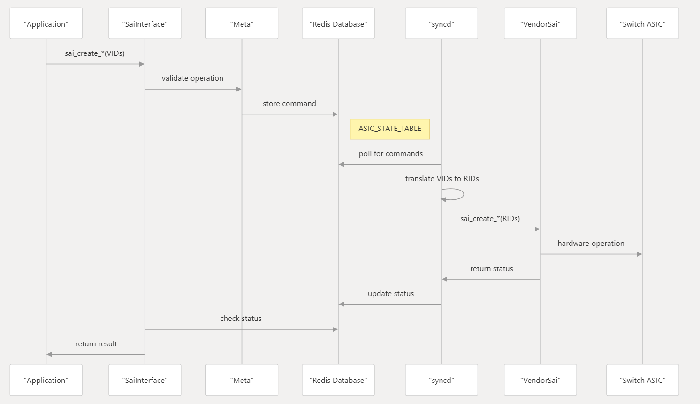

Beyond the architecture and Juniper-specific integrations, SONiC interviews often pivot toward **Linux-level networking**, **database schemas**, and **troubleshooting complex state flows**. 

Here are the critical questions categorized by "Day 2" operations and deep-system internals.

---

### 1. Data Path & Lifecycle Questions
These questions test if you understand how a configuration actually becomes a hardware reality.

* **Explain the "Packet to CPU" path in SONiC.**
    * *Context:* When a BGP packet or an ARP request hits a port, how does it reach the container? 
    * *Answer:* The ASIC identifies the packet as "control plane traffic" and sends it to the host CPU. The **Syncd** container receives it and pushes it into the Linux Kernel via a **TAP interface**. From there, the standard Linux networking stack delivers it to the socket where the relevant container (like BGP or LLDP) is listening.

Understanding the "Packet to CPU" path (often called the **Control Plane Path**) is vital for troubleshooting why BGP sessions aren't establishing or why LACP is failing. In SONiC, this path is complex because the packet must cross several boundaries: **Hardware ASIC → Syncd Container → Host Kernel → Target Container.**

---

## 1. The ASIC Trap (Hardware Layer)
When a control plane packet (like a BGP Open message or an ARP request) hits a physical port, the ASIC doesn't just forward it to another port.
* **Punt/Trap Rules:** The ASIC is programmed with specific **SAI Trap Groups**. These rules tell the hardware: "If you see a packet with Destination Port 179 (BGP), don't switch it; encapsulate it and send it to the CPU."
* **Host Interface (hif):** The ASIC sends the packet over a high-speed PCIe or Ethernet bus connecting the switch silicon to the x86 CPU.

---

## 2. The Syncd Container (The Receiver)
The `syncd` container is the only process that speaks directly to the hardware SDK/SAI.
* **SAI Receive:** The SAI library inside `syncd` receives the packet from the ASIC.
* **Metadata:** The packet is usually accompanied by metadata (e.g., which physical port it came from).
* **Injection to Kernel:** `syncd` needs to get this packet into the standard Linux networking stack. It writes the packet into a specific **TAP interface** (a virtual Ethernet interface) that exists in the Host OS.

---

## 3. The Host Kernel (The Router)
The Host OS (Debian) sees these TAP interfaces (like `Ethernet0`, `Ethernet4`, etc.) just like a regular Linux server sees a physical NIC.
* **Netlink:** The kernel receives the packet from the TAP device and processes it through the standard TCP/IP stack.
* **Socket Delivery:** The kernel looks at the packet's destination (IP and Port) and determines which process has an open socket for that traffic.

---

## 4. The Application Container (The Destination)
Most networking applications in SONiC run in their own Docker containers.
* **Shared Network Namespace:** Most SONiC containers (like the `bgp` container) run in the **Host Network Namespace** (`--net=host`). This means the container sees the same interfaces and routing table as the Host OS.
* **The Daemon:** Inside the `bgp` container, the FRR (Free Range Routing) daemon is listening on TCP port 179. It pulls the packet from the kernel socket and processes the BGP state change.

---

## 🔄 The Reverse Path (CPU to Packet)
When the BGP daemon wants to send a keepalive, the process is reversed:
1.  **BGP Container** writes to a socket.
2.  **Host Kernel** routes it out of a TAP interface (e.g., `Ethernet0`).
3.  **Syncd** sees the packet on the TAP interface (via a packet socket or similar mechanism).
4.  **Syncd** calls the `sai_send_packet` API.
5.  **ASIC** pushes the physical bits out of the copper/fiber port.

---

## 🛠️ Critical Troubleshooting Points
If you aren't receiving control packets, you can "follow the trail" using these tools:

1.  **Check the ASIC:** Use `bcmcmd` (on Broadcom) to see if the "trap" counters are incrementing.
2.  **Check Syncd/Host Interface:** Use `tcpdump -i Ethernet0` on the Host OS. If you see the packet here, the hardware and `syncd` are doing their jobs.
3.  **Check the Container:** Enter the container (`docker exec -it bgp bash`) and use `tcpdump` inside. Since it's a shared namespace, if you saw it in the host, you should see it here.
4.  **Check IP Tables:** Sometimes the Host OS `iptables` or `nftables` rules might be dropping the packet before it reaches the container's application.

---

### Summary of Component Roles
| Component | Responsibility |
| :--- | :--- |
| **ASIC** | Identifies control packets and "punts" them to CPU. |
| **Syncd** | Bridged hardware SDK to Linux TAP interfaces. |
| **TAP Interface** | Virtual representation of a physical port in Linux. |
| **Host Kernel** | Handles the TCP/IP stack and socket multiplexing. |
| **Protocol Container** | Runs the actual logic (BGP, LLDP, LACP). |

* **What happens if the `Redis` container crashes?**
    * *Answer:* This is a "critical failure" scenario. Since Redis holds the state for everything, its loss typically triggers a system-wide restart or a "Critical Process" reboot. However, if **Warm Boot** is enabled and configured, the data plane (ASIC) might continue to forward traffic for a short window while the control plane recovers.
* **What is the difference between `STATE_DB` and `APPL_DB`?**
    * *Answer:* `APPL_DB` stores the **intent** (what the applications *want* to happen, like "add this route"). `STATE_DB` stores the **actual status** of the system (what is *currently true*, like "this physical port is up and synchronized").

---

### 2. Linux & Container Internals
SONiC is essentially a specialized Debian distribution. You need to know how it leverages Linux tools.

* **How does SONiC manage physical interfaces in the Linux Kernel?**
    * *Answer:* SONiC creates **front-panel port interfaces** (e.g., `eth0`, `Ethernet0`) in the host kernel. It uses tools like `ip link` and `teamd` to manage these. The `portsyncd` daemon listens for Netlink events from the kernel to sync these states back to Redis.
* **Why does SONiC use Docker containers instead of simple systemd services?**
    * *Answer:* Portability and isolation. It allows developers to use different libraries or languages (Python, C++, Go) for different services without dependency conflicts. It also simplifies "hitless" upgrades of individual components.
* **How do you perform a packet capture in SONiC?**
    * *Answer:* You can run `tcpdump` on the host or inside a specific container on the relevant interface. Since traffic is mapped to Linux TAP devices, standard Linux tools work perfectly.

---

### 3. Management & Automation
Modern networking is about APIs, not just CLIs.

* **What is the SONiC Management Framework?**
    * *Answer:* It's the newer architecture that provides a unified interface for **gNMI, RESTConf, and a Northbound CLI**. It uses **YANG models** to define how data is structured, moving away from direct manual edits of `config_db.json`.
* **How do you verify if a specific configuration successfully reached the ASIC?**
    * *Answer:* You check the chain:
        1.  `sonic-db-dump -k CONFIG_DB ...` (User input)
        2.  `sonic-db-dump -k APPL_DB ...` (Orchestration intent)
        3.  `sonic-db-dump -k ASIC_DB ...` (Final instruction to the driver)
* **What is the role of `gBSL` (Generic Binary Search Library) or similar testing tools in SONiC?**
    * *Context:* This refers to the **SONiC Testbed** or **Pytest** framework. They might ask how you contribute a feature and ensure it doesn't break other hardware (the answer is community-run CI/CD pipelines using virtual SONiC nodes).

---

### 4. Advanced Troubleshooting Scenarios
* **Scenario:** You configured a VLAN, but traffic isn't passing. `show vlan config` looks correct. What is your next step?
    * *Target Answer:* Check the `orchagent` logs (`show logging | grep orchagent`). If `orchagent` failed to process the VLAN (perhaps due to a resource limit in the ASIC), the error will be there. Then check `ASIC_DB` to see if the entry exists.
* **Scenario:** The BGP neighbor is "Up" in the BGP container, but the routes aren't in the hardware routing table.
    * *Target Answer:* Check `fpmsyncd`. This is the process responsible for moving routes from the BGP container (FRR) to the Redis `APPL_DB`. If `fpmsyncd` is stuck, the hardware never learns the routes.

---

### 📋 Comparison Summary for Interviews
| Concept | Traditional NOS | SONiC |
| :--- | :--- | :--- |
| **Config Store** | Text files (running-config) | Redis Database (JSON/Key-Value) |
| **Messaging** | Internal IPC / Message Bus | Redis Pub/Sub |
| **Hardware Abstraction** | Proprietary SDKs | SAI (Switch Abstraction Interface) |
| **Extension** | Limited (Scripts) | Full (Custom Docker Containers) |

===========================

