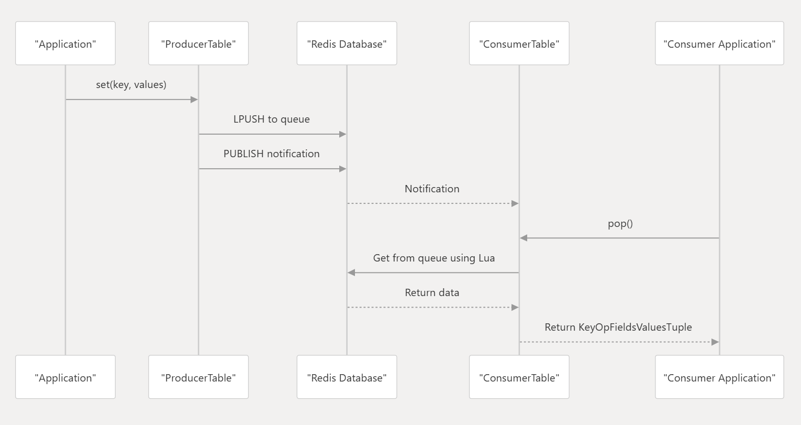

## Overview
The Producer-Consumer pattern in sonic-swss-common facilitates asynchronous communication between components through Redis. This pattern is implemented through specialized classes that handle the production and consumption of data:

Producer Side	Consumer Side	Purpose
ProducerTable	ConsumerTable	Key-value operations with pub/sub notification
ProducerStateTable	ConsumerStateTable	State management with optimized synchronization
Each pair provides a different approach to inter-component communication, with state tables offering more advanced state management capabilities.



## Producer Components
ProducerTable

The ProducerTable class handles the production side of key-value operations. It enqueues database changes and sends notifications to consumers.

Key methods:

- set(key, values, op): Stores field-value pairs for a key
- del(key, op): Removes a key
- flush(): Executes buffered operations

## Consumer Components
ConsumerTable

The ConsumerTable class retrieves key-value operations from Redis and processes them according to their operation type.

Key methods:

- pop(kco): Retrieves a single key-operation-value tuple
- pops(vkco): Retrieves multiple key-operation-value tuples
- setModifyRedis(bool): Controls whether Redis is modified during pop operations

## Usage Examples
Basic Producer-Consumer Example

```cpp
// Producer side
DBConnector db(APPL_DB, 0);
ProducerTable producer(&db, "MY_TABLE");
 
// Set values
vector<FieldValueTuple> values;
values.push_back(FieldValueTuple("field1", "value1"));
values.push_back(FieldValueTuple("field2", "value2"));
producer.set("key1", values);
 
// Consumer side
DBConnector db(APPL_DB, 0);
ConsumerTable consumer(&db, "MY_TABLE");
Select s;
s.addSelectable(&consumer);
 
// Wait for and process notifications
Selectable *sel;
int result = s.select(&sel);
if (result == Select::OBJECT) {
    KeyOpFieldsValuesTuple kco;
    consumer.pop(kco);
    
    string key = kfvKey(kco);
    string op = kfvOp(kco);
    auto values = kfvFieldsValues(kco);
    
    // Process the data...
```

## Buffered State Table Example
// Producer with buffering

```cpp
DBConnector db(APPL_DB, 0);
RedisPipeline pipeline(&db);
ProducerStateTable producer(&pipeline, "MY_TABLE", true);
 
// Multiple operations are buffered
for (int i = 0; i < 1000; i++) {
    vector<FieldValueTuple> fields;
    fields.push_back(FieldValueTuple("field1", "value1"));
    producer.set("key" + to_string(i), fields);
}
 
// Execute all at once
producer.flush();
 
// Consumer with batch retrieval
ConsumerStateTable consumer(&db, "MY_TABLE", 100);
Select s;
s.addSelectable(&consumer);
 
// Retrieve multiple items at once
deque<KeyOpFieldsValuesTuple> entries;
s.select(&sel);

```

