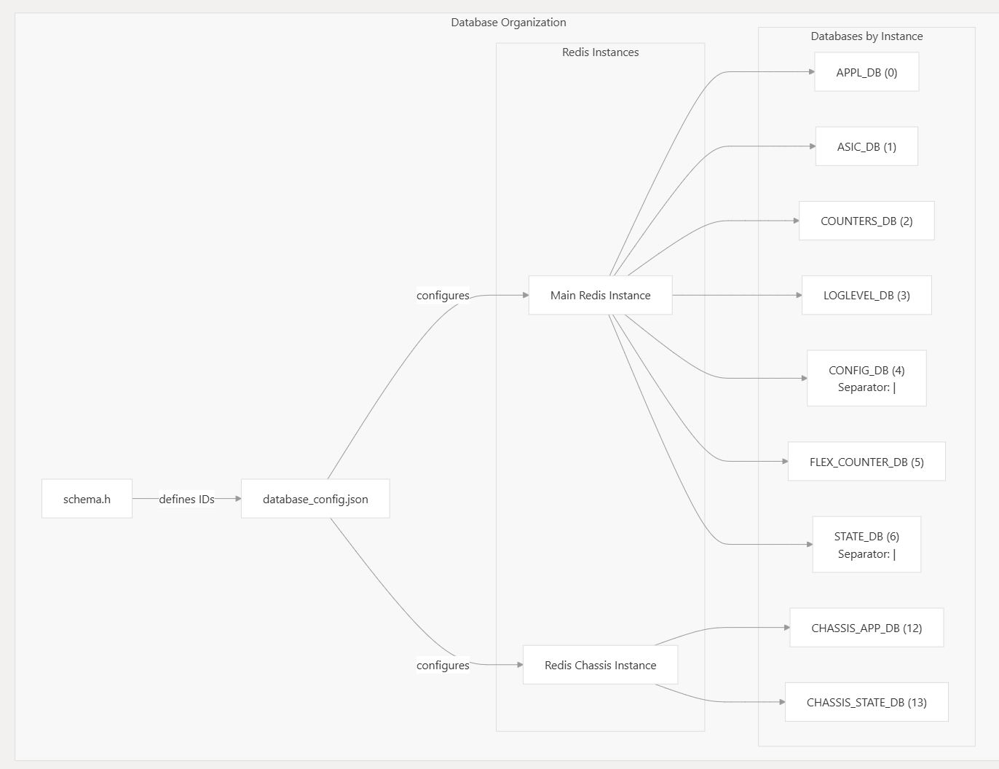
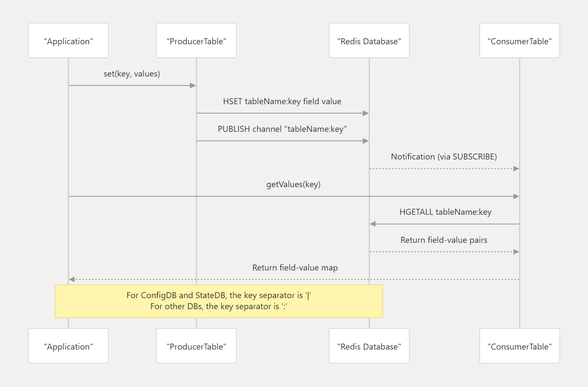
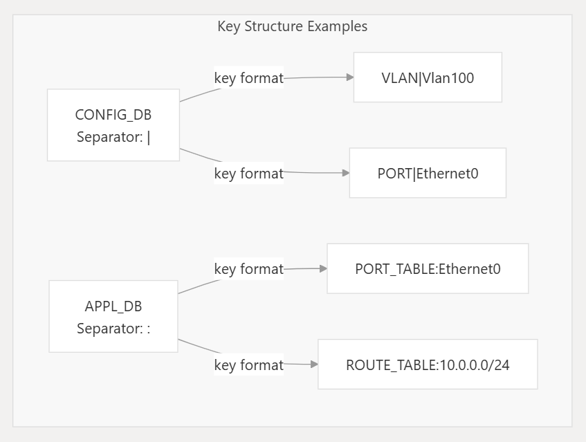
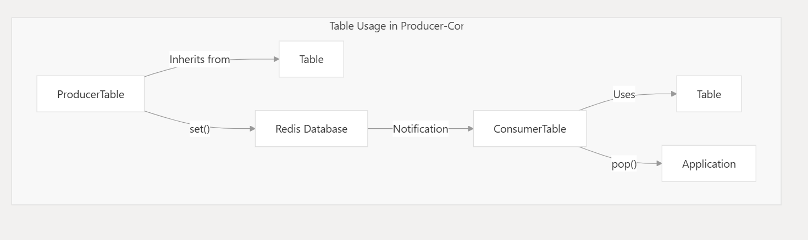

SONiC uses Redis as its primary database system. The configuration of Redis instances and database organization is defined in the database_config.json file.

## Redis Instance Configuration
SONiC typically uses two Redis instances:

- Main Redis Instance - Hosts most of the databases
- Redis Chassis Instance - Dedicated for chassis-related databases

## Database Configuration Structure
The database_config.json file contains the following structure:

- INSTANCES: Defines Redis server instances (hostname, port, unix socket path)
- DATABASES: Maps logical database names to:
    - id: The Redis database ID number
    - separator: Character used to separate components in keys
    - instance: Which Redis instance hosts this database

```bash
Database Name	ID	Separator	Redis Instance	Purpose
APPL_DB	0	:	redis	Application-generated data
ASIC_DB	1	:	redis	ASIC-specific data
COUNTERS_DB	2	:	redis	Counter statistics
LOGLEVEL_DB	3	:	redis	Logging level configuration
CONFIG_DB	4	|	redis	System configuration data
FLEX_COUNTER_DB	5	:	redis	Flexible counter data
STATE_DB	6	|	redis	System state information
CHASSIS_APP_DB	12	|	redis_chassis	Chassis application data
CHASSIS_STATE_DB	13	|	redis_chassis	Chassis state information
APPL_STATE_DB	14	:	redis	Application state data
```



## Database IDs & Table Name Definitions

Database IDs are defined as constants in `schema.h` and are used to identify specific databases when establishing connections. something like:

```c
#define APP_PORT_TABLE_NAME               "PORT_TABLE"
#define APP_VLAN_TABLE_NAME               "VLAN_TABLE"
#define APP_VLAN_MEMBER_TABLE_NAME        "VLAN_MEMBER_TABLE"
#define APP_LAG_TABLE_NAME                "LAG_TABLE"
#define APP_LAG_MEMBER_TABLE_NAME         "LAG_MEMBER_TABLE"
...
```

## Database Access Pattern
The SONiC architecture uses a publisher-subscriber model for database access. Applications write to the database using producer classes and read from it using consumer classes. The interaction is facilitated by Redis pub/sub mechanisms.






## Database Configuration Lifecycle

The database configuration is loaded when the system starts. The database_config.json file is typically installed in `/var/run/redis/sonic-db/` directory and is marked as a `conffile`, meaning it's preserved during package upgrades.


## Database Interaction Components

The database configuration system consists of three main components:

- `SonicDBConfig`: Singleton configuration manager that parses JSON files to determine database connection parameters
- `DBConnector`: High-level Redis connection abstraction providing database operations
- `RedisContext`: Low-level Redis connection management using the hiredis library


## DBConnector
Redis Operations Interface
`DBConnector` provides a comprehensive set of Redis operations organized by data type and use case:

Basic Key-Value Operations
```bash
Method	Redis Command	Purpose	Return Type
set(key, value)	SET	Store string value	bool
get(key)	GET	Retrieve string value	shared_ptr<string>
del(key)	DEL	Delete key	int64_t
exists(key)	EXISTS	Check key existence	bool
incr(key)	INCR	Increment counter	int64_t
decr(key)	DECR	Decrement counter	int64_t
```
## List and Pub/Sub Operations
Category	Method	Redis Command	Purpose
Lists	rpush(list, item)	RPUSH	Add to list tail
Lists	blpop(list, timeout)	BLPOP	Blocking pop from head
Pub/Sub	subscribe(pattern)	SUBSCRIBE	Subscribe to channel
Pub/Sub	psubscribe(pattern)	PSUBSCRIBE	Pattern subscribe
Pub/Sub	publish(channel, msg)	PUBLISH	Publish message

## Usage Patterns
Basic Database Connection
```cpp
// Connect by database name (requires SonicDBConfig initialization)
DBConnector db("APPL_DB", 0, false);
 
// Connect by database ID directly
DBConnector db(0, "127.0.0.1", 6379, 0);
 
// Connect with namespace support
DBConnector db("APPL_DB", 0, false, "asic0");
```

## Usage Examples
Basic Table Usage
```cpp
// Create a connection to the database
DBConnector db("CONFIG_DB", 0, true);
 
// Create a table
Table table(&db, "PORT_TABLE");
 
// Set values
vector<FieldValueTuple> values;
values.push_back(make_pair("mtu", "9000"));
values.push_back(make_pair("admin_status", "up"));
table.set("Ethernet0", values);
 
// Get values
vector<FieldValueTuple> retrieved_values;
table.get("Ethernet0", retrieved_values);
 
// Delete entry
table.del("Ethernet0");
```
## Table Content Enumeration
```cpp
// Get all keys in the table
vector<string> keys;
table.getKeys(keys);
 
// Get all content in the table
vector<KeyOpFieldsValuesTuple> tuples;
table.getContent(tuples);
 
// Process each entry
for (auto& tuple : tuples) {
    string key = kfvKey(tuple);
    vector<FieldValueTuple>& values = kfvFieldsValues(tuple);
    // Process key and values
}
```
> https://github.com/sonic-net/sonic-swss-common/blob/21eb452f/common/table.cpp#L191-L206




